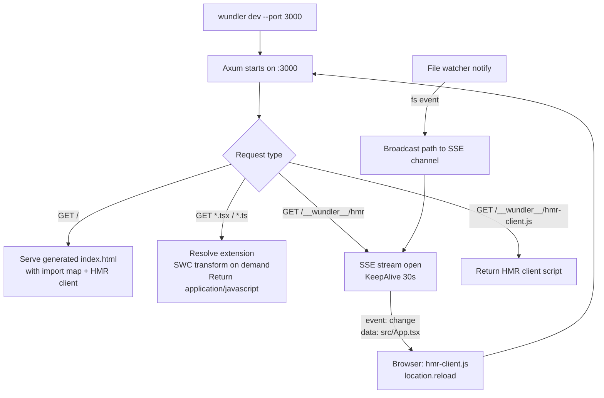
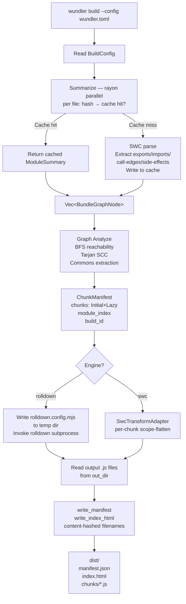
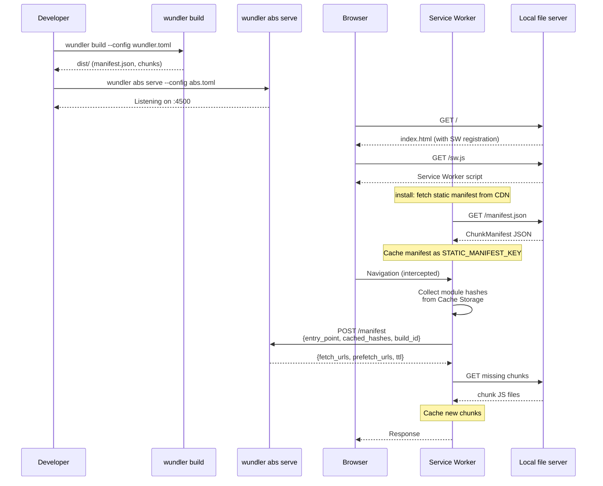
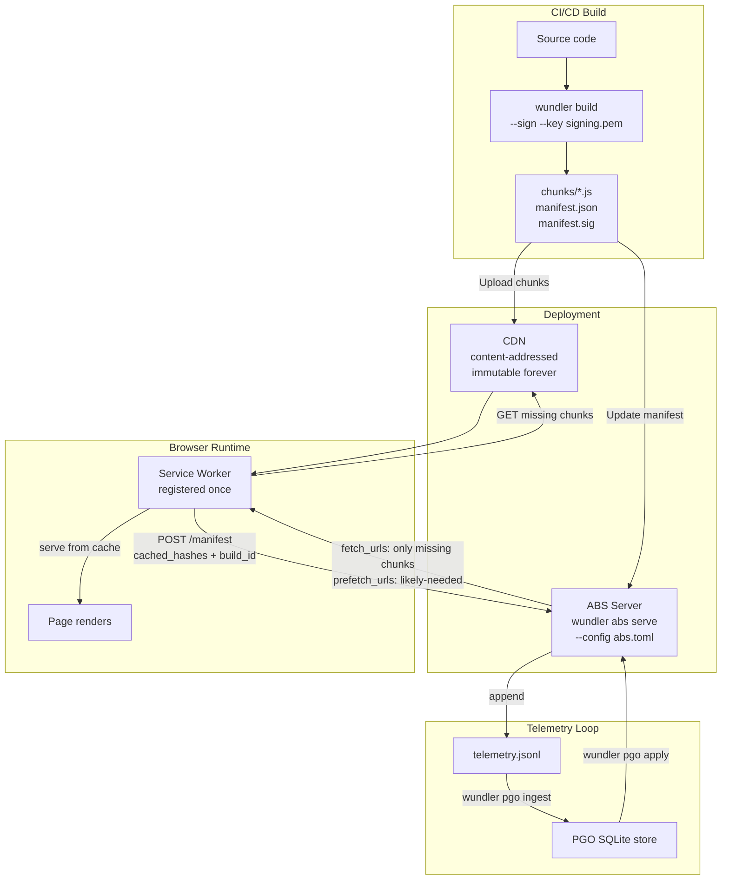
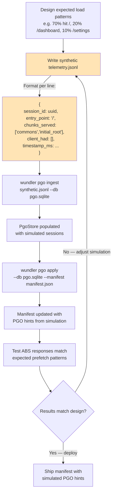
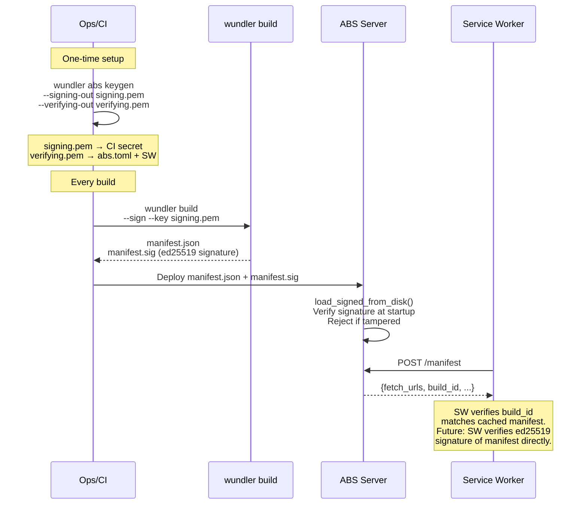

# wundler workflows

Workflow diagrams for every major user journey in wundler. Each diagram is rendered with Mermaid and renders directly in GitHub. Use this document as a map: find the journey that matches what you are doing, then jump to the relevant section of `DEVELOPERS.md` or `CONFIGURATION.md` for detail.

## 1. Local development

The `wundler dev` flow. An Axum server starts on the configured port and serves a generated `index.html` that embeds an import map and a small HMR client. TypeScript and JSX files are transformed on demand by SWC with no caching — every request runs the full transform. Bare specifier requests are resolved by trying `.tsx`, `.ts`, `.jsx`, `.js`, and the corresponding `/index.*` variants in order. A file watcher writes change events to an SSE channel; `hmr-client.js` listens and calls `location.reload()` when a relevant path changes.

Use this when iterating on source. There is no production-equivalent bundling here; the dev server is a transform proxy with reload.



## 2. Production build (RolldownAdapter)

The full build pipeline as run from `wundler build`. The summarizer is a `rayon` parallel iterator over the source tree; for each file it hashes the bytes and consults a 2-tier content-addressed cache before reaching for SWC. Graph analysis operates on `ModuleSummary` values (~2KB each), not source, so it is fast even at 50k modules. `RolldownAdapter` writes a temporary rolldown config that enumerates every chunk's entry stub and invokes rolldown once as a subprocess. Output JS files are read back from `out_dir`, content-hashed, and listed in `manifest.json` alongside the generated `index.html`.

Use this for production builds and for CI.



## 3. Incremental rebuild

When a single source file changes, the summarizer hashes it, misses the cache, re-parses it with SWC, and writes a fresh `ModuleSummary`. Every other file's summary is reused from cache. Graph analysis is re-run from scratch — but it operates on summaries, not source, so it costs microseconds per module. Only the chunks whose member modules changed are re-transformed.

Use this to reason about the cost of a single-file edit during a watch-mode build, or to understand why the second build is much faster than the first.

```mermaid
flowchart TD
    A[Source file changes] --> B[wundler build again]
    B --> C[Summarizer: hash file]
    C --> D{Hash matches<br/>cached summary?}
    D -->|Yes — unchanged| E[Return cached summary<br/>~microseconds]
    D -->|No — changed| F[Re-parse with SWC<br/>New ModuleSummary<br/>Update cache]
    E --> G[Graph analysis on<br/>all summaries<br/>O&#40;summaries&#41; not O&#40;source&#41;]
    F --> G
    G --> H[New ChunkManifest<br/>New build_id]
    H --> I[Transform only<br/>affected chunks]
    I --> J[Atomic write new chunks<br/>Update manifest.json]
```



## 4. ABS in development

Running the Adaptive Bundle Service locally to exercise the delta protocol. The dev ABS serves unsigned manifests. The Service Worker is not registered by default in the dev `index.html` — it is opt-in. Once registered, the SW intercepts navigations, collects the module-level hashes currently in Cache Storage, and POSTs them to the ABS. The ABS replies with the minimum fetch set.

Use this to verify SW behavior, manifest delta correctness, and Cache Storage population before deploying.



## 5. ABS in production

The production topology. The CDN is immutable — content-hashed chunks never change after they are uploaded. Only the ABS updates when a new build is deployed: it loads the new `manifest.json` and resumes serving deltas. Telemetry from `POST /manifest` is appended to a JSONL log which is later consumed by the PGO ingestor.

Use this as the reference picture for production deployment planning, capacity sizing, and the topology of CI handoffs to runtime.



## 6. PGO with real user traffic

The production PGO cycle. The ABS writes one JSONL line per `POST /manifest` request. `wundler pgo ingest` is idempotent — re-running it on the same log is safe and produces the same store. Once `wundler pgo status` reports `READY` (default: ≥100 sessions), the C³ pass computes merge candidates from conditional co-request probabilities, and `wundler pgo apply` writes the hints into `manifest.json` atomically. The ABS picks up the new manifest on its next load.

Use this once your application has real user traffic. The defaults assume real traffic; see workflow 7 for synthetic data.

```mermaid
flowchart TD
    A[Users navigate your app] --> B[Service Worker<br/>POST /manifest to ABS]
    B --> C[ABS delta computation<br/>TelemetryLogger appends:<br/>{session_id, entry_point,<br/>chunks_served, timestamp}]
    C --> D[telemetry.jsonl grows]

    D -->|daily/hourly cron| E[wundler pgo ingest<br/>telemetry.jsonl --db pgo.sqlite]
    E --> F[PgoStore<br/>SQLite co-request matrix<br/>idempotent: re-ingest safe]

    F --> G{Enough sessions?<br/>Default: 100 min}
    G -->|No — wundler pgo status<br/>shows NOT READY| H[Keep collecting]
    G -->|Yes — wundler pgo status<br/>shows READY| I[wundler pgo analyze<br/>--manifest manifest.json<br/>Preview merge suggestions]

    I --> J{Suggestions acceptable?}
    J -->|No| H
    J -->|Yes| K[wundler pgo apply<br/>--db pgo.sqlite<br/>--manifest dist/manifest.json]

    K --> L[manifest.json updated atomically<br/>co_request_score populated<br/>suggested_merge hints written]
    L --> M[ABS reloads manifest<br/>New prefetch_urls in responses<br/>Browser pre-caches likely chunks]
```

## 7. PGO with synthetic sessions

Synthetic PGO is for bootstrapping. Use it before launch, in load tests, or in CI to validate that the PGO pipeline operates as designed. The JSONL format is identical to the real telemetry format; you can hand-write it, generate it from a load-test harness, or replay an anonymized production log.



> **Real vs Simulated PGO**
>
> Simulated sessions let you bootstrap PGO hints before launch. The `merge_threshold` default (0.70) is calibrated for real traffic. Synthetic sessions often produce P(b|a) = 1.0 for co-requested chunks — this saturates the threshold and may over-merge. Consider using `merge_threshold: 0.90` when working with synthetic data, and re-run `wundler pgo apply` after your first 1,000 real sessions.
>
> The `wundler pgo status` command shows `READY/NOT READY` based on `min_sessions` (default: 100). For synthetic bootstrapping, you may want to lower this to 10 or 20 and raise it in production.

## 8. Manifest signing and verification

Ed25519 keys are generated once with `wundler abs keygen`. The signing key (`signing.pem`) is a CI secret; the verifying key (`verifying.pem`) is embedded in the ABS config and, eventually, in the Service Worker. Every build calls `wundler build --sign --key signing.pem` which writes `manifest.sig` next to `manifest.json`. At startup the ABS verifies the signature and refuses to serve if the file has been tampered.

Use this for any production deployment where the ABS could be reached by untrusted clients.


