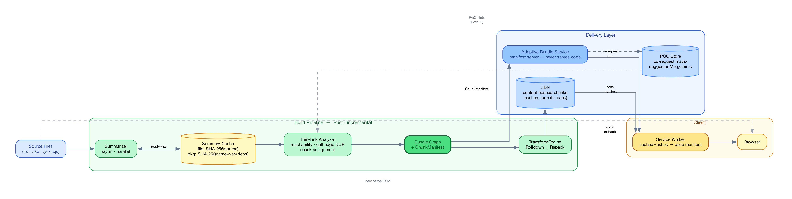
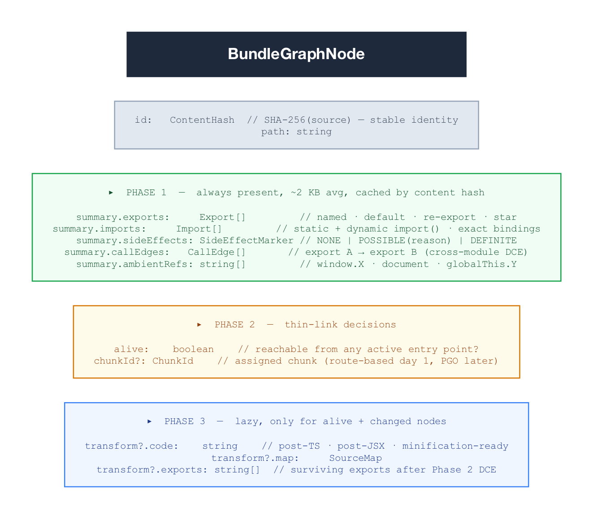

# Wundler: A Linker-Inspired Module Graph Architecture

**Architecture Brief · 2026-05-13**

---

## The Problem

Every extant JS bundler — Vite, webpack, esbuild, Rspack, Rolldown — performs eager global analysis on every invocation. The module graph is re-traversed from scratch regardless of what changed. Build time is O(n) in total module count, not O(Δ). At 50,000+ modules this is not a profiling problem or a parallelism problem; it is an architectural category error. The linker world solved this in 2019–2022. We're applying those solutions here.

---

## Intellectual Foundation: The Linker Isomorphism

The central insight is that JavaScript bundling and native-code linking are structurally isomorphic problems. The linker world's solutions map directly — sometimes identically — to the bundler domain.


**mold's parallelism model** rewrote LLD's 35%-serial symbol-table insertion into a concurrent `oneTBB::concurrent_hash_map` with sharded string dedup. The key architectural insight: LLD's `DenseMap` (single-threaded) was the bottleneck, not the computations themselves. Wundler's Phase 1 applies the same principle: `rayon` parallel iterators, one summarizer task per source file, zero shared mutable state.

**ThinLTO** is the closest prior art. It splits monolithic LTO into three decoupled phases: (1) per-module compile → summary index (parallel, incremental), (2) thin-link on summaries only (serial, fast — summaries are kilobytes, not megabytes), (3) per-module backend guided by thin-link decisions (parallel). A `FunctionSummary` in ThinLTO carries call edges, type IDs, hotness, and side-effect markers — exactly what a `ModuleSummary` in Wundler carries for JavaScript exports. The key insight ThinLTO proved: **you can do accurate cross-module optimization without ever loading the full IR of every module simultaneously.** Summaries are sufficient for all global decisions.

**BOLT and Propeller** introduced profile-guided binary layout — reordering basic blocks and functions by measuring actual runtime call patterns rather than guessing at static heuristics. BOLT's C³ clustering algorithm and Propeller's `--symbol-ordering-file` (derived from `perf` profiles) are the direct ancestors of Wundler's PGO chunk grouping in the Adaptive Bundle Service.

**Incremental linking** (mold's approach over gold's) avoids on-disk state persistence — mold just re-runs so fast that the OS page cache makes the "second link" essentially free. For summaries that are 2KB each, Wundler's Phase 1 is the same: re-summarizing an unchanged module is cheaper than deserializing a complex on-disk structure.

**Dynamic linking** — GOT/PLT, late-bound symbol resolution, `ld.so` loading only what's referenced — is the conceptual ancestor of Wundler's Adaptive Bundle Service. The browser client resolves module dependencies at runtime against a manifest server, fetching only what it doesn't already have. The service worker is `ld.so`. The content-hashed CDN chunks are shared libraries. The delta manifest is the `.so` lookup.

---

## Architecture



### Components

**Bundle Graph** — the primary artifact. Not a bundle file. A content-addressed DAG where nodes are modules and edges are import relationships. The Bundle Graph is persisted across builds. All output artifacts (static bundles, chunk files, ABS delta responses, native ESM for dev) are *materializations* — different query strategies over the same graph. There is no separate dev/prod build; there is one graph and two materialization modes.

**Summary Cache** — two-tier, content-addressed. File-level key: `SHA-256(source)`. Package-level key: `SHA-256(pkg-name + version + dep-tree-hash)` for `node_modules`, which are structurally stable between dev iterations. A CI-seeded remote layer (Azure Blob / S3) populates the cache for developers on cold builds. Phase 1 cost for a developer is proportional to `|changed_source_files|`, not `|total_modules|`.

**Thin-Link Analyzer** — operates exclusively on summaries. At 50k modules × ~2KB/summary ≈ 100MB total. Single-threaded bandwidth-bound scan: ~50ms. Three passes: (1) BFS/DFS reachability from entry points — dead modules skip Phase 3 entirely and are never transformed; (2) call-edge DCE — exports unreachable from live entry points via the call graph are marked dead; (3) chunk assignment — route-based splits at `import()` boundaries on day 1, PGO-refined after Level 1 collects data. Re-runs only when a summary changes (new imports or exports); pure implementation edits don't touch Phase 2.

**ChunkManifest** — Phase 2's output. The handshake between the build system and the Adaptive Bundle Service:

```
ChunkManifest {
  buildId:      string                         // SHA of entry points
  chunks:       Chunk[]
  entryChunks:  Record<EntryPoint, ChunkId[]>  // what to load per route
  moduleIndex:  Record<ContentHash, ChunkId>   // O(1) lookup

  Chunk {
    id, modules: ContentHash[], hash: ContentHash
    loadCondition: INITIAL | LAZY | PREFETCH
    coRequestScore?:  number    // P(this chunk | initial load) — ABS-populated
    suggestedMerge?:  ChunkId   // ABS recommendation, no rebuild required
  }
}
```

**TransformEngine** — pluggable interface behind `transformChunk(modules, chunkId, decisions) → ChunkOutput`. Two concrete adapters: `RolldownAdapter` (Rust-native, default, no FFI on hot path) and `RspackAdapter` (webpack-compatible, for stacks already on Rspack). Phase 3 wall-clock time scales as `|changed_alive_modules| / cores`. Unchanged modules hit the transform cache (keyed on `ContentHash`). Dead modules — those marked `alive: false` by Phase 2 — never reach Phase 3.

**CJS Stub Generator** — `module.exports = { ... }` is evaluated, not declared. For CJS packages: execute the package entry in an isolated `happy-dom` worker, enumerate `Object.keys(module.exports)`, emit a synthetic `.mjs` stub with named exports. The stub is what Phase 1 summarizes. Same approach as Cloudpack; only accurate method for dynamic export patterns.

---

## The Bundle Graph Node



The `SideEffectMarker` deserves specific mention. JavaScript's module-level code is the hardest correctness problem in the system. The rule applied here is the ThinLTO rule: **conservative at module boundaries, aggressive at function boundaries.** Module-level code (any statement that executes at `import` time) is conservatively assumed to have side effects unless proven otherwise. Function-level code (named exports, helper functions) is aggressively eliminated if unreachable from live entry points via call-edge reachability. A correctness audit mode diffs Conservative-only output against the heuristic on every build and alerts on divergence — this is a non-negotiable safety net before any tree-shaking reaches production.

---

## Adaptive Bundle Service & PGO Feedback Loop

The ABS is a manifest server, not a code server. CDN serves code. This distinction drives the security model: ABS compromise lets an attacker redirect clients to different *existing* content-hashed chunks, not inject arbitrary code. Build-time ed25519 signing of chunk hashes enables the service worker to detect manifest tampering.

**Protocol:**
```
Client → ABS: { entryPoint, cachedHashes: ContentHash[], buildId? }
ABS → Client: { buildId, fetchUrls: URL[], prefetchUrls: URL[], ttl }
```

The ABS records which chunks were served together per session — the co-request log. Over time this builds a matrix approximating P(chunk\_A | chunk\_B). C³-style clustering (BOLT-derived) identifies chunks that are always co-fetched and proposes `suggestedMerge` hints into the ChunkManifest. The chunk reorganization applies to future requests *without a rebuild* — the graph is unchanged, only the ChunkManifest's `suggestedMerge` entries update. This is the PGO feedback loop closing: usage data from production flows back into chunk assignment decisions, improving delivery without engineering intervention.

Every client already has a service worker managing module assets at this scale. The delta-manifest protocol is a SW configuration update. Failure degrades transparently to `manifest.json` on CDN.

---

## Correctness Invariants

| Invariant | Mechanism |
|---|---|
| Module-level side effects preserved | Conservative `SideEffectMarker` at module boundary |
| Function-level dead code eliminated | Call-edge reachability across summary graph |
| CJS exports correctly enumerated | Worker execution + synthetic `.mjs` stub |
| Tree-shaking correctness verified | Audit mode: diff Conservative vs heuristic on every build |
| Build output immutable | Content-hash keyed chunks on CDN; `buildId` invalidation |
| ABS never a SPOF | SW timeouts at 100ms p99 → falls back to `manifest.json` |
| Transform engine correct-by-default | Rolldown / Rspack behind `TransformEngine` interface |

---

## Deployment Levels

| Level | What ships | New infra | When |
|---|---|---|---|
| **0 — Static** | ThinBundle replaces build pipeline; chunks + `manifest.json` on CDN | None | Month 3 |
| **1 — Adaptive** | ABS manifest server + SW delta protocol | ABS service | Month 4+ |
| **2 — PGO** | Co-request matrix drives `suggestedMerge` chunk refinement | PGO store | Month 6+ |

Level 0 is independently valuable: faster CI builds, dead-code elimination at scale, no dev/prod divergence. Levels 1 and 2 are additive optimizations that degrade cleanly to Level 0 if unavailable. The Month 1 gate — run Phase 1 across the full production module graph and confirm ~100MB summary cache size — validates the entire architecture before any further investment.
