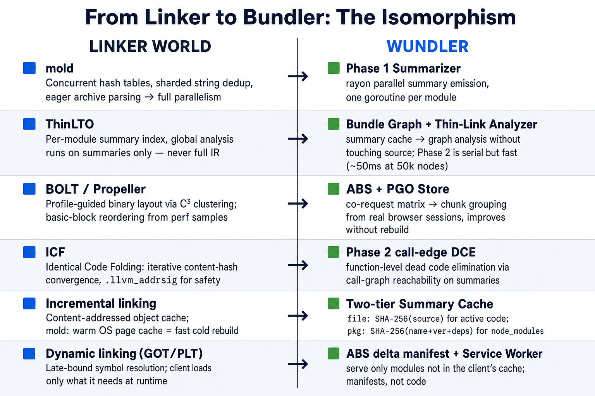
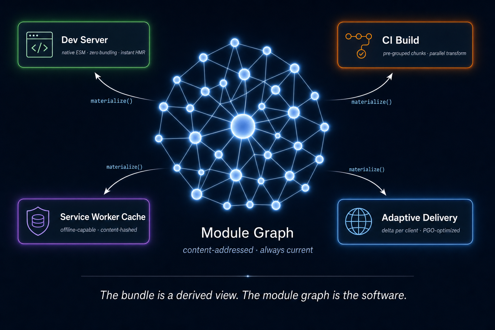
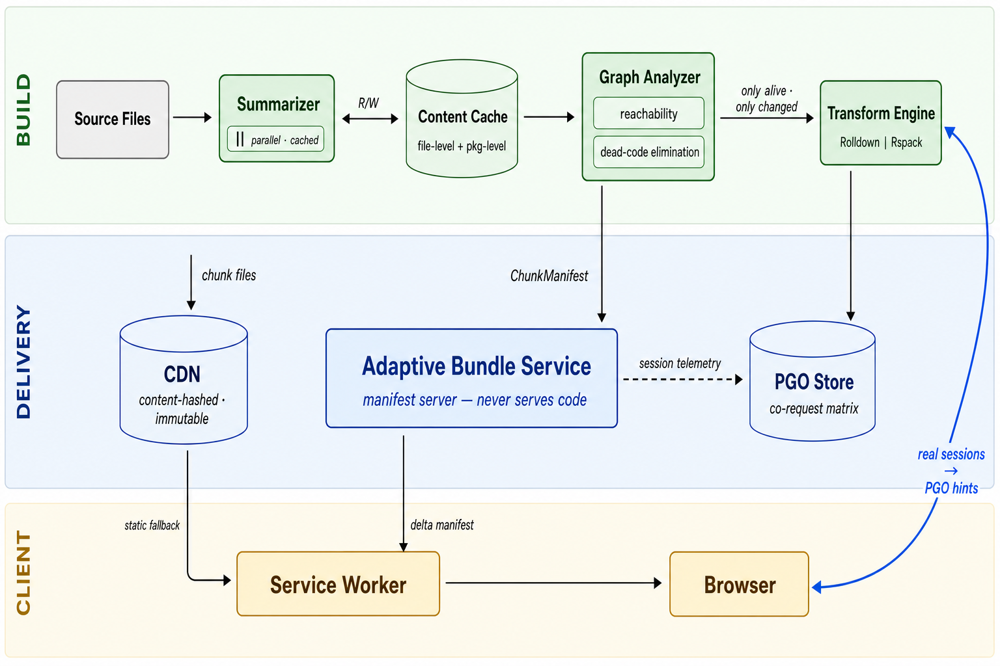
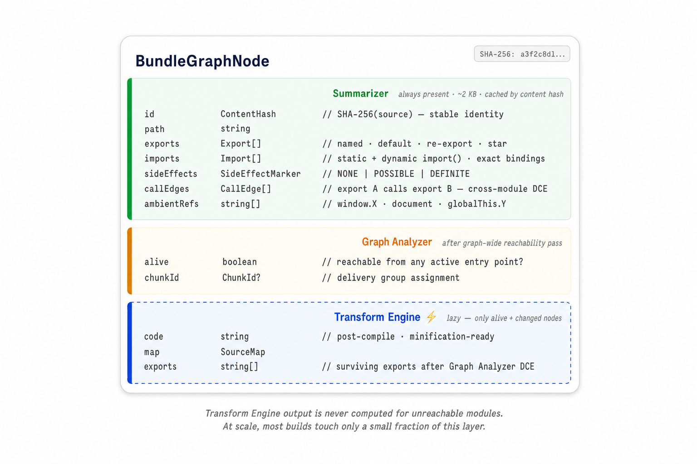

# Wundler

**The module graph is the software. The bundle is a query.**

Wundler is a continuously-maintained module graph and delivery system for large-scale JavaScript applications. Source files are parsed into a compact graph of metadata. All output forms — development servers, CI artifacts, production bundles, adaptive per-client delivery — are materializations of that graph. One graph, many queries.

---

## The Problem

Every extant JS bundler performs eager global analysis on every invocation. Build time is O(n) in total module count, not O(Δ). At 50,000+ modules this is an architectural category error, not a profiling problem. The linker world solved the equivalent problem across 2019–2022.

---

## From Linker to Bundler



JavaScript bundling and native-code linking are structurally isomorphic. Each linker innovation maps directly.

**mold** rewrote LLD's 35%-serial symbol-table insertion with a concurrent `oneTBB::concurrent_hash_map` and sharded string dedup. LLD's `DenseMap` (single-threaded) was the bottleneck, not the computation. Wundler's Summarizer applies the same design: `rayon` parallel iterators, one task per source file, no shared mutable state.

**ThinLTO** split monolithic LTO into three decoupled operations: per-module summary emission (parallel, cached), global analysis on summaries only (serial, fast — summaries are kilobytes), per-module backend guided by those decisions (parallel again). A `FunctionSummary` carries call edges, type IDs, hotness, and side-effect markers — precisely what a Wundler `ModuleSummary` carries for JavaScript. ThinLTO proved that accurate cross-module optimization never requires loading every module's full IR simultaneously. Summaries are sufficient.

**BOLT and Propeller** introduced profile-guided binary layout, reordering basic blocks and functions by measuring actual runtime call patterns rather than static heuristics. BOLT's C³ clustering algorithm and Propeller's `--symbol-ordering-file` are the direct ancestors of Wundler's PGO chunk grouping in the Adaptive Bundle Service.

**Incremental linking** (mold's model, not gold's) avoids on-disk state persistence entirely. mold reruns so fast that the OS page cache makes the second link essentially free. For 2KB summaries, resummarizig an unchanged module is cheaper than deserializing a complex on-disk structure — so Wundler does the same.

**Dynamic linking** — GOT/PLT, late-bound symbol resolution, `ld.so` loading only what's referenced — is the conceptual ancestor of the Adaptive Bundle Service. The service worker is `ld.so`. Content-hashed CDN chunks are shared libraries. The delta manifest is the `.so` lookup. The browser fetches only what it doesn't already have.

---

## The Mental Model



The central data structure is the **Bundle Graph**: a content-addressed DAG where nodes are modules and edges are import relationships, persisted across builds. One graph, two materialization strategies: dev serves native ESM directly from summary data; production materializes chunk files through the Transform Engine. No separate dev/prod pipeline. No divergence.

---

## System Architecture



### Components

**Summarizer** — parses each source file and emits a compact `ModuleSummary` (~2KB): exports (named, default, re-export, star), imports (static and dynamic, exact bindings), a `SideEffectMarker`, inter-export call edges, and ambient global references. Runs in parallel. Cached by `SHA-256(source)` — a file that hasn't changed costs nothing. For `node_modules`, the cache key is `SHA-256(pkg-name + version + dep-tree)`, skipping source hashing entirely for packages whose version hasn't moved.

A CI-seeded remote cache (Azure Blob / S3) means developer cold builds populate from a cache seeded in CI. Summarizer cost scales with changed source files, not total module count.

**Graph Analyzer** — reads all summaries and builds the full module graph. Three passes: (1) BFS/DFS reachability from entry points, marking unreachable modules dead; (2) call-edge DCE, marking exports unreachable from live entry points as dead; (3) delivery group assignment. Operates on summary data only. At 50k modules, the entire working set is ~100MB — a bandwidth-bound serial scan takes ~50ms. Re-runs only when a summary changes (new imports or exports added). Implementation-only edits never touch it.

**ChunkManifest** — the Graph Analyzer's output, and the handshake with the Adaptive Bundle Service:

```
ChunkManifest {
  buildId:      string                         // SHA of entry points
  chunks:       Chunk[]
  entryChunks:  Record<EntryPoint, ChunkId[]>
  moduleIndex:  Record<ContentHash, ChunkId>

  Chunk {
    id, modules: ContentHash[], hash: ContentHash
    loadCondition: INITIAL | LAZY | PREFETCH
    coRequestScore?:  number    // P(chunk | initial load) — ABS-populated
    suggestedMerge?:  ChunkId   // ABS recommendation, no rebuild required
  }
}
```

**Transform Engine** — produces output files for alive, changed modules only. Behind a `TransformEngine` interface: `RolldownAdapter` (Rust-native, default) and `RspackAdapter` (webpack-compatible). Wall-clock time scales as `|changed_alive_modules| / cores`. Dead modules never reach this component.

**CJS Stub Generator** — `module.exports` is evaluated, not declared. For CJS packages: execute the entry point in an isolated `happy-dom` worker, enumerate exports, emit a synthetic `.mjs` stub. The stub is what the Summarizer parses. Only accurate method for dynamic export patterns.

---

## The Module Graph Node



The `SideEffectMarker` requires specific attention. The rule: conservative at module boundaries, aggressive at function boundaries. Module-level code (any statement executing at import time) is conservatively assumed to have side effects unless proven otherwise. Export-level code is aggressively eliminated if unreachable from live entry points via call-edge reachability. A correctness audit mode diffs Conservative-only output against the heuristic on every build and alerts on divergence. This runs before any tree-shaking reaches production.

---

## Adaptive Bundle Service & PGO

The ABS is a manifest server. The CDN serves code. This separation defines the security model: ABS compromise redirects clients to different existing content-hashed chunks — not code injection. Build-time ed25519 signing of chunk hashes lets the service worker detect manifest tampering.

```
Client → ABS:  { entryPoint, cachedHashes: ContentHash[], buildId? }
ABS → Client:  { buildId, fetchUrls: URL[], prefetchUrls: URL[], ttl }
```

The ABS logs co-request patterns per session. Over time the PGO Store builds `P(chunk_A | chunk_B)`. C³-style clustering identifies chunks that should merge. `suggestedMerge` hints update the ChunkManifest without a rebuild — the graph is unchanged, only the delivery groupings shift. This is the feedback loop: production traffic continuously improves chunk layout. Every sufficiently large web application already ships a service worker managing module assets. The delta-manifest protocol is a configuration update to an existing component, not new infrastructure.

**Failure degrades transparently.** Service worker timeout at 100ms p99 falls back to `manifest.json` on CDN. The ABS is never on the hard critical path.

---

## Correctness Invariants

| Invariant | Mechanism |
|---|---|
| Module-level side effects preserved | Conservative `SideEffectMarker` at module boundary |
| Export-level dead code eliminated | Call-edge reachability from live entry points |
| CJS exports correctly enumerated | Worker execution + synthetic `.mjs` stub |
| Tree-shaking correctness verified | Audit mode: diff Conservative vs heuristic every build |
| Output immutability | Content-hash-keyed CDN chunks; `buildId` invalidation |
| ABS never a SPOF | 100ms SW timeout → fallback to static `manifest.json` |
| Transform correctness inherited | Rolldown / Rspack behind pluggable `TransformEngine` |

---

## Deployment

| Level | Capability | New infra | When |
|---|---|---|---|
| **0 — Static** | Replaces build pipeline; chunks + `manifest.json` on CDN | None | Month 3 |
| **1 — Adaptive** | ABS delta serving + SW protocol | ABS service | Month 4+ |
| **2 — PGO** | Co-request-driven chunk reorganization | PGO store | Month 6+ |

Level 0 ships independently and already outperforms the current toolchain: incremental builds proportional to changes, dead code eliminated at scale. The Month 1 gate — run the Summarizer across the full production module graph and confirm ~100MB summary cache size — validates the entire architecture before further investment.
